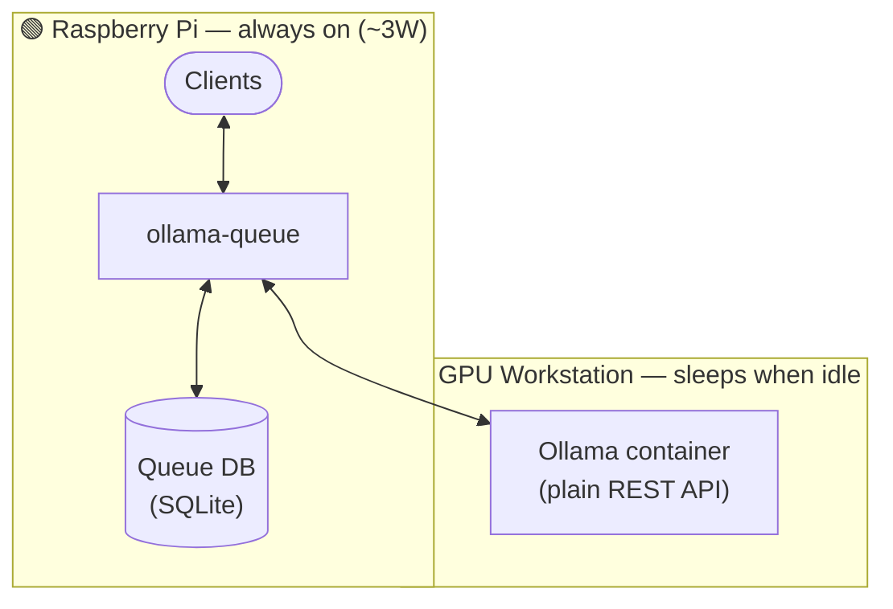

# ollama-queue

An intelligent, energy-saving message queue and automation gateway for Ollama LLM servers. It queues non-urgent requests and automatically wakes up your heavy AI hardware via Wake-on-LAN (WoL) only when an urgent message arrives or a timeout threshold is reached.

## 🌟 Features

- **Asynchronous Message Queueing:** Accept and store LLM prompts instantly via a lightweight REST API.
- **Urgency Detection:** Instantly flags high-priority messages to trigger hardware wake-up.
- **Smart Wake-on-LAN (WoL):** Sends a magic packet over Ethernet to wake the Ollama server from hibernate.
- **Interval Processing:** Wakes up the server periodically to clear non-urgent queues if no urgent messages arrive.
- **Flexible Delivery:** Supports both Webhook callbacks (Push) and Status Polling (Pull) for long-running LLM tasks.
- **Low-Power Gateway:** Designed to run on a Raspberry Pi (~3W) so your heavy GPU hardware can sleep when idle — wake it only when needed.

## 🛠️ Architecture

The key idea: a **Raspberry Pi** (or similar low-power SBC) runs `ollama-queue` 24/7, drawing only a few watts. Your heavy GPU workstation sleeps most of the time and is only woken up when there's actual work to do — via Wake-on-LAN over the local network.

Since LLM generation can take a long time and the GPU server is often asleep, `ollama-queue` decouples the request from the response:



## 🚀 API Specification

### 1. Enqueue a Message
`POST /api/queue`

**Request Body:**
```json
{
  "prompt": "Analyze this urgent server log...",
  "model": "llama3.1",
  "priority": "high", 
  "callback_url": "myclient.internal"
}
```

**Response (Instant 202 Accepted):**
```json
{
  "job_id": "8f3b9c2a-1234-4567-abcd-ef7412589630",
  "status": "queued",
  "priority": "high",
  "estimated_delivery": "Depends on server wake up time"
}
```

### 2. Poll Status (Alternative Return Channel)
`GET /api/status/:job_id`

**Response (While processing/queued):**
```json
{
  "job_id": "8f3b9c2a-1234-4567-abcd-ef7412589630",
  "status": "processing"
}
```

**Response (When finished):**
```json
{
  "job_id": "8f3b9c2a-1234-4567-abcd-ef7412589630",
  "status": "completed",
  "response": "Here is the completed AI analysis..."
}
```

## 🔧 Implementation Details

### Technology Stack
- **Language:** Python 3
- **API framework:** FastAPI
- **Queue storage:** SQLite (via SQLAlchemy)
- **Concurrency:** Multithreaded — API thread accepts requests instantly, worker thread drains the queue

### Priority Levels
| Value | Behaviour |
|-------|-----------|
| `high` | Triggers an immediate Wake-on-LAN and skips the interval wait |
| `low` | Queued and processed at the next scheduled interval |

### Job Lifecycle
```
queued → processing → ready → closed
                    ↘ failed
```
| Status | Meaning |
|--------|---------|
| `queued` | Job accepted, waiting to be processed |
| `processing` | GPU workstation is awake, Ollama is generating |
| `ready` | Result stored in DB, not yet delivered to client |
| `closed` | Client has received the result (polled or webhook delivered) |
| `failed` | Job failed 3 times in a row — will not be retried |

### Concurrency
`OLLAMA_CONCURRENCY` controls how many Ollama requests are in-flight at the same time. `1` means fully sequential — the next job only starts after the previous one completes. Increase for models or hardware that can handle parallel inference.

### GPU Workstation Readiness
After sending the Wake-on-LAN magic packet, the worker polls Ollama's health endpoint (`GET /api/tags`) with exponential backoff (2 s → 4 s → 8 s … up to 5 minutes total). If Ollama does not respond within the timeout, the attempt counts as one failure toward the retry limit.

### Error Handling
- **Retry logic:** Each job is retried up to 3 times before being marked `failed`.
- **Alerting:** Email notification on terminal failure is planned but not yet implemented.

## ⚙️ Configuration

Configure the application via environment variables or a `.env` file:

```env
HOST=0.0.0.0
PORT=8080
DATABASE_URL=sqlite:///./ollama_queue.db

OLLAMA_HOST=http://192.168.1.50:11434   # full base URL of the Ollama server
OLLAMA_TIMEOUT=300                       # seconds to wait for an Ollama response
OLLAMA_CONCURRENCY=1                     # max parallel requests to Ollama (1 = sequential)

WORKER_BATCH_INTERVAL=2.0               # low-priority batch window (seconds)
WORKER_WOL_TIMEOUT=300                  # max seconds to wait for Ollama after WoL
WORKER_MAX_RETRIES=3                    # how many times to retry a failed job
WORKER_RETRY_DELAY=5.0                  # seconds between retries

WOL_MAC_ADDRESS=AA:BB:CC:DD:EE:FF      # leave blank to disable Wake-on-LAN
WOL_BROADCAST=255.255.255.255
WOL_PORT=9
```

## 📦 Python Client Library

A minimal blocking client library is included so you can integrate `ollama-queue` directly into your own Python applications without managing HTTP calls or polling logic yourself.

### Installation

```bash
pip install ollama-queue-client
```

### Usage

```python
from ollama_queue import OllamaQueueClient

client = OllamaQueueClient("http://raspberrypi:3000")

result = client.generate(
    model="llama3.1",
    messages=[
        {"role": "system", "content": "You are a trading analyst. Respond in JSON."},
        {"role": "user",   "content": "BTC price is 42000, position is LONG..."},
    ],
    priority="low",       # "high" or "low"
    format="json",        # optional: forces Ollama to return valid JSON
    poll_interval=5,      # seconds between status polls (default: 5)
    timeout=600,          # max seconds to wait (default: 600)
)

print(result)  # string — JSON or plain text depending on 'format'
```

`generate()` blocks until the job status is `ready` and returns the LLM response as a string. Raises `TimeoutError` if the job does not complete within `timeout` seconds.

### Notes
- No threading — one blocking call per `generate()` invocation
- `messages` follows the standard chat format (`role` + `content`) so system prompts and multi-turn context are supported
- `format="json"` passes Ollama's format option through — useful when the response must be machine-parseable
- `callback_url` is not used by the client library; it relies solely on polling

## 📝 License

MIT